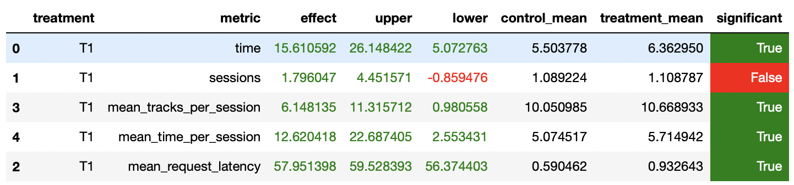

# Отчет

## Abstract
Тюним нейросетевой рекомендр, а так же запрещаем предсказывать треки, которые не понравились пользователю.

## Детали
Выбираем лучшие параметры для нейросетевого рекомендера.

Для каждого трека прогнозируем рекомендации.

Для каждого пользователя запоминаем, какие треки ему понравились.

Предсказываем пользователю следущий трек, запрещая предсказывать треки, которые пользователю не понравились.

## Результаты A/B эксперимента
Получилось добиться прироста порядка 12%.

https://github.com/ikekz/recsys-itmo-spring-2023

pip install -r requirements.txt

Заранить все ячейки в ноутбуке /jupyter/ABTest.ipynb
